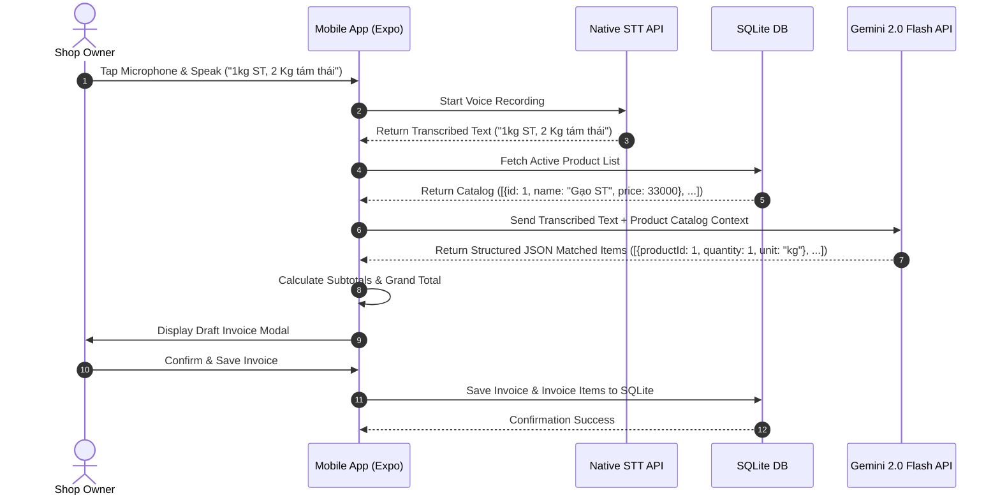

# VoiceBill - Voice Retail Invoice Mobile App Design Document

**Date**: 2026-07-29  
**Status**: Approved  
**Target Platform**: React Native (Expo SDK 51+)  

---

## 1. Overview & Objective

VoiceBill is a mobile application designed for retail shop owners (e.g., rice store owners) to instantly create retail invoices using Vietnamese voice commands. 

The application listens to spoken phrases (e.g., *"1kg ST, 2 Kg tám thái"*), uses native mobile Speech-To-Text (STT) to convert voice to text, sends the text along with the store's registered product catalog to Google Gemini AI to parse structured line items, calculates totals from local unit prices, and outputs an invoice draft for fast confirmation and saving.

### Key Features
1. **Voice Input & AI Invoice Parsing**: Convert voice input to text and automatically parse line items against existing product catalog.
2. **Product Catalog Management**: Add, update, delete products with custom units and unit prices.
3. **Local Storage**: 100% local data storage on device using SQLite (`expo-sqlite`).
4. **Excel Export**: Export invoice history filtered by Day, Week, or Month into downloadable `.xlsx` files.

---

## 2. System Architecture & Tech Stack

### Tech Stack
- **Framework**: React Native with Expo (SDK 51+)
- **Database**: SQLite (`expo-sqlite`)
- **Speech-to-Text**: `expo-speech-recognition` / Native Speech Recognition API
- **AI Parser**: Google Gemini 2.0 Flash API (Direct LLM JSON mode)
- **Excel Export**: `xlsx` (SheetJS) + `expo-file-system` + `expo-sharing`
- **UI & Design System**: Vanilla React Native Components / React Native Paper with modern clean aesthetics (Tailwind/NativeWind optional)

### System Data Flow


---

## 3. Database Schema (SQLite)

### Table: `products`
Stores registered store items and unit prices.

| Column | Type | Constraints | Description |
|---|---|---|---|
| `id` | INTEGER | PRIMARY KEY AUTOINCREMENT | Unique product ID |
| `name` | TEXT | NOT NULL UNIQUE | Product name (e.g., "Gạo ST") |
| `unit` | TEXT | NOT NULL DEFAULT 'kg' | Unit of measurement (e.g., "kg", "túi", "bao") |
| `unit_price` | REAL | NOT NULL | Unit price in VND (e.g., 33000) |
| `created_at` | DATETIME | DEFAULT CURRENT_TIMESTAMP | Timestamp created |

### Table: `invoices`
Stores header information for generated retail bills.

| Column | Type | Constraints | Description |
|---|---|---|---|
| `id` | INTEGER | PRIMARY KEY AUTOINCREMENT | Unique invoice ID |
| `invoice_code` | TEXT | NOT NULL UNIQUE | Generated code (e.g., "HD-20260729-001") |
| `total_quantity` | REAL | NOT NULL | Total units/quantity sold |
| `total_amount` | REAL | NOT NULL | Total invoice amount in VND |
| `created_at` | DATETIME | DEFAULT CURRENT_TIMESTAMP | Date and time created |

### Table: `invoice_items`
Stores individual line items within an invoice.

| Column | Type | Constraints | Description |
|---|---|---|---|
| `id` | INTEGER | PRIMARY KEY AUTOINCREMENT | Unique line item ID |
| `invoice_id` | INTEGER | FOREIGN KEY (`invoices.id`) | Reference to parent invoice |
| `product_id` | INTEGER | FOREIGN KEY (`products.id`) | Reference to product |
| `product_name` | TEXT | NOT NULL | Snapshot of product name at sale time |
| `quantity` | REAL | NOT NULL | Quantity sold |
| `unit` | TEXT | NOT NULL | Unit measurement |
| `unit_price` | REAL | NOT NULL | Snapshot of unit price at sale time |
| `amount` | REAL | NOT NULL | Subtotal (`quantity * unit_price`) |

---

## 4. AI Prompting & Parsing Specification

### Gemini API Configuration
- **Model**: `gemini-2.0-flash`
- **Output Format**: JSON (`response_mime_type: "application/json"`)

### System Instruction Template
```json
{
  "role": "system",
  "content": "Bạn là trợ lý AI thông minh cho ứng dụng VoiceBill. Nhiệm vụ của bạn là bóc tách thông tin sản phẩm và số lượng từ văn bản giọng nói người dùng.\n\nQUY TẮC BẮT BUỘC:\n1. BẠN CHỈ ĐƯỢC PHÉP KHỚP VỚI CÁC SẢN PHẨM CÓ TRONG DANH SÁCH SẢN PHẨM CHO TRƯỚC (available_products).\n2. Nếu tên sản phẩm được đọc ngắn gọn (ví dụ 'ST', 'tám thái'), hãy tìm sản phẩm phù hợp nhất trong danh sách.\n3. Quy đổi tất cả các từ chỉ khối lượng Tiếng Việt ('cân', 'ký', 'kg', 'kí') về cùng đơn vị số lượng số thực.\n4. Bỏ qua các từ thừa, từ nối không thuộc danh sách sản phẩm.\n5. Trả về mảng JSON theo định dạng schema yêu cầu."
}
```

### Input Payload Context
```json
{
  "transcript": "bán cho chị 1kg ST với 2 cân tám thái",
  "available_products": [
    {"id": 1, "name": "Gạo ST", "unit": "kg"},
    {"id": 2, "name": "Gạo Tám Thái", "unit": "kg"},
    {"id": 3, "name": "Gạo Bắc Hương", "unit": "kg"}
  ]
}
```

### Expected Output JSON Response
```json
{
  "matched_items": [
    {
      "product_id": 1,
      "product_name": "Gạo ST",
      "quantity": 1.0,
      "unit": "kg"
    },
    {
      "product_id": 2,
      "product_name": "Gạo Tám Thái",
      "quantity": 2.0,
      "unit": "kg"
    }
  ],
  "unmatched_text": []
}
```

---

## 5. Screen Structure & User Interface

1. **Home Screen (Voice Billing)**
   - Header with quick app status & API status indicator.
   - Central prominent Microphone button with pulse animation when active.
   - Realtime Speech-to-Text transcript display box.
   - Action button: "Phân tích hóa đơn" (Auto-triggers on voice stop).
   - **Draft Invoice Modal**:
     - Line items table: Product Name | Quantity | Unit Price | Amount.
     - Summary bar: Total Quantity | Grand Total Amount.
     - Buttons: "Xác nhận & Lưu", "Hủy".

2. **Product Catalog Screen**
   - List of all registered products sorted alphabetically.
   - Product Card: Name, Unit, Formatted Unit Price (e.g. `33.000 đ/kg`).
   - "Thêm sản phẩm" FAB button / Modal.
   - Swipe or button actions for Edit & Delete.

3. **Invoices History & Excel Report Screen**
   - Filter segmented controls: **Hôm nay (Today)**, **Tuần này (This Week)**, **Tháng này (This Month)**.
   - Key Metrics summary card: Total Invoices count, Total Revenue (VND), Total Quantity (kg).
   - Scrollable list of past invoices with expandable detailed line items.
   - Prominent **"Xuất file Excel"** button -> Generates formatted `.xlsx` spreadsheet and triggers Native Share Sheet.

---

## 6. Verification & Test Plan

### Automated Verification
1. Database Schema migrations & CRUD tests for Products and Invoices.
2. Unit tests for AI Parsing response handler & edge case inputs (e.g., fractional numbers like "nửa cân", "1.5 kg").
3. Excel generation test to ensure valid `.xlsx` buffer output.

### Manual Verification
1. Test speech input with Vietnamese dialects & shorthand terms.
2. Verify exact total calculation for multiple item voice entries.
3. Test exporting Excel file and opening on mobile device (Zalo/Files/Drive).
