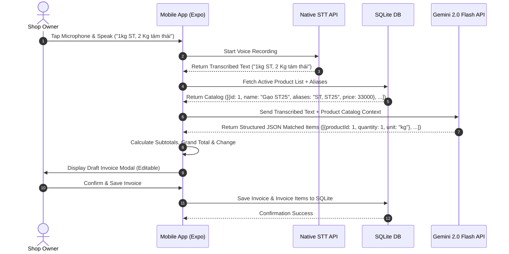

# VoiceBill - Voice Retail Invoice Mobile App Design Document

**Date**: 2026-07-29  
**Status**: Approved & Reviewed  
**Target Platform**: React Native (Expo SDK 51+)  

---

## 1. Overview & Objective

VoiceBill is a mobile application designed for retail shop owners (e.g., rice store owners) to instantly create retail invoices using Vietnamese voice commands. 

The application listens to spoken phrases (e.g., *"1kg ST, 2 Kg tám thái"*), uses native mobile Speech-To-Text (STT) to convert voice to text, sends the text along with the store's registered product catalog to Google Gemini AI to parse structured line items, calculates totals from local unit prices, and outputs an invoice draft for fast confirmation and saving.

### Key Features
1. **Voice Input & AI Invoice Parsing**: Convert voice input to text and automatically parse line items against existing product catalog.
2. **Product Catalog & Alias Management**: Add, update, delete products with custom units, unit prices, and alternative keywords/aliases (e.g. "ST", "ST25" for "Gạo ST25").
3. **Retail Business Capabilities**: Support discount input, customer payment / cash change calculation ("Khách đưa - Tiền thừa"), and customer notes.
4. **Local Storage & Offline Readiness**: 100% local data storage on device using SQLite (`expo-sqlite`). Manual line item editing supported if offline.
5. **Excel Export**: Export invoice history filtered by Day, Week, or Month into downloadable `.xlsx` files.

---

## 2. System Architecture & Tech Stack

### Tech Stack
- **Framework**: React Native with Expo (SDK 51+)
- **Database**: SQLite (`expo-sqlite`)
- **Speech-to-Text**: `expo-speech-recognition` / Native Speech Recognition API
- **AI Parser**: Google Gemini 2.0 Flash API (Direct LLM JSON mode)
- **Excel Export**: `xlsx` (SheetJS) + `expo-file-system` + `expo-sharing`
- **UI & Design System**: Vanilla React Native Components with clean modern dark/light mode aesthetic

### System Data Flow


---

## 3. Database Schema (SQLite)

### Table: `products`
Stores registered store items, unit prices, and search aliases.

| Column | Type | Constraints | Description |
|---|---|---|---|
| `id` | INTEGER | PRIMARY KEY AUTOINCREMENT | Unique product ID |
| `name` | TEXT | NOT NULL UNIQUE | Official product name (e.g., "Gạo ST25") |
| `aliases` | TEXT | NULLABLE | Comma-separated shorthand keywords (e.g., "ST, ST25, Sóc Trăng") |
| `unit` | TEXT | NOT NULL DEFAULT 'kg' | Unit of measurement (e.g., "kg", "túi", "bao") |
| `unit_price` | REAL | NOT NULL | Unit price in VND (e.g., 33000) |
| `created_at` | DATETIME | DEFAULT CURRENT_TIMESTAMP | Timestamp created |

### Table: `invoices`
Stores header information for generated retail bills including retail business calculations.

| Column | Type | Constraints | Description |
|---|---|---|---|
| `id` | INTEGER | PRIMARY KEY AUTOINCREMENT | Unique invoice ID |
| `invoice_code` | TEXT | NOT NULL UNIQUE | Generated code (e.g., "HD-20260729-001") |
| `customer_name` | TEXT | NULLABLE | Optional customer name / note (e.g. "Chị Hoa") |
| `total_quantity` | REAL | NOT NULL | Total units/quantity sold |
| `subtotal_amount` | REAL | NOT NULL | Total before discount |
| `discount_amount` | REAL | DEFAULT 0 | Discount amount in VND |
| `final_amount` | REAL | NOT NULL | Net total amount in VND |
| `paid_amount` | REAL | NULLABLE | Cash paid by customer |
| `change_amount` | REAL | NULLABLE | Cash change returned to customer |
| `created_at` | DATETIME | DEFAULT CURRENT_TIMESTAMP | Date and time created |

### Table: `invoice_items`
Stores individual line items within an invoice.

| Column | Type | Constraints | Description |
|---|---|---|---|
| `id` | INTEGER | PRIMARY KEY AUTOINCREMENT | Unique line item ID |
| `invoice_id` | INTEGER | FOREIGN KEY (`invoices.id`) | Reference to parent invoice |
| `product_id` | INTEGER | FOREIGN KEY (`products.id`) | Reference to product |
| `product_name` | TEXT | NOT NULL | Snapshot of product name at sale time |
| `quantity` | REAL | NOT NULL | Quantity sold |
| `unit` | TEXT | NOT NULL | Unit measurement |
| `unit_price` | REAL | NOT NULL | Snapshot of unit price at sale time |
| `amount` | REAL | NOT NULL | Subtotal (`quantity * unit_price`) |

---

## 4. AI Prompting & Parsing Specification

### Gemini API Configuration
- **Model**: `gemini-2.0-flash`
- **Output Format**: JSON (`response_mime_type: "application/json"`)

### System Instruction Specification
```json
{
  "role": "system",
  "content": "Bạn là trợ lý AI cho ứng dụng bán lẻ VoiceBill. Nhiệm vụ của bạn là bóc tách thông tin sản phẩm và số lượng từ văn bản giọng nói.\n\nQUY TẮC BẮT BUỘC:\n1. BẠN CHỈ ĐƯỢC PHÉP KHỚP VỚI CÁC SẢN PHẨM TRONG DANH SÁCH available_products (dựa vào name hoặc aliases).\n2. Quy đổi các đại lượng số lượng Tiếng Việt:\n   - 'nửa cân' / 'nửa ký' -> 0.5\n   - 'lạng' -> 0.1\n   - 'yến' -> 10\n   - 'tạ' -> 100\n   - 'chục cân' -> 10\n   - 'cân', 'ký', 'kg', 'kí' -> quy đổi về dạng số thực (ví dụ '2 cân rưỡi' -> 2.5).\n3. Bỏ qua các từ thừa hoặc từ không khớp sản phẩm.\n4. Trả về mảng JSON đúng theo định dạng schema."
}
```

### Input Payload Context Example
```json
{
  "transcript": "bán cho chị 1kg ST với 2 cân rưỡi tám thái",
  "available_products": [
    {"id": 1, "name": "Gạo ST25", "aliases": ["ST", "ST25"], "unit": "kg"},
    {"id": 2, "name": "Gạo Tám Thái", "aliases": ["tám thái", "tám"], "unit": "kg"},
    {"id": 3, "name": "Gạo Bắc Hương", "aliases": ["bắc hương"], "unit": "kg"}
  ]
}
```

### Expected Output JSON Response
```json
{
  "matched_items": [
    {
      "product_id": 1,
      "product_name": "Gạo ST25",
      "quantity": 1.0,
      "unit": "kg"
    },
    {
      "product_id": 2,
      "product_name": "Gạo Tám Thái",
      "quantity": 2.5,
      "unit": "kg"
    }
  ],
  "unmatched_text": []
}
```

---

## 5. Real-World Business & Logic Review

### Business Logic Review
- **Vietnamese Quantities & Fractional Units**: The AI system prompt specifically handles real-world spoken Vietnamese expressions such as *"rưỡi"* (2.5), *"nửa cân"* (0.5), *"lạng"* (0.1), *"chục"* (10).
- **Product Shorthand Matching**: Shop owners rarely speak full product names like *"Gạo Sóc Trăng ST25 hạng nhất"*. Adding the `aliases` column enables exact matching for short spoken terms like *"ST"* or *"ST25"*.
- **Cash & Discount Handling**: Added optional fields for discount (giảm giá), customer paid amount (khách đưa), and cash change calculation (tiền thừa) directly on the draft invoice UI.

### Technical & Offline Error Handling
- **Offline / Network Loss Fallback**: If internet connection fails during Gemini API call, the app displays a clear toast notification and allows manual product search & line item addition on the draft invoice screen.
- **API Key Management**: Settings screen allows shop owners to enter their Gemini API Key or use a pre-configured key.

---

## 6. Screen Structure & User Interface

1. **Home Screen (Voice Billing)**
   - Header with active API & Network connection indicator.
   - Central prominent Microphone button with pulse soundwave visualizer.
   - Live Speech-to-Text transcript display box.
   - **Draft Invoice Modal**:
     - Line items table: Product Name | Quantity | Unit Price | Subtotal | [Remove Item].
     - Quick "Add Item Manually" search button.
     - Summary & Payment bar: Total Quantity | Subtotal | Discount | Net Total | Customer Paid | Cash Change.
     - Buttons: "Xác nhận & Lưu", "Hủy".

2. **Product Catalog Screen**
   - List of products with Name, Aliases badge, Unit, and Formatted Unit Price.
   - Add/Edit Product Modal (fields: Name, Aliases/Shorthands, Unit, Unit Price).
   - Quick search bar and delete actions.

3. **Invoices History & Excel Report Screen**
   - Date range selector: **Hôm nay**, **Tuần này**, **Tháng này**, or Custom Range.
   - Summary statistics card: Total Bills, Total Revenue (VND), Total Quantity (kg).
   - List of past invoices with expandable detailed line items.
   - **"Xuất file Excel (.xlsx)"** button: Generates detailed spreadsheet with headers (Mã HD, Ngày tạo, Tên SP, Số lượng, Đơn giá, Thành tiền, Chiết khấu, Thực thu) and invokes Native Share dialog.

4. **Settings Screen**
   - Gemini API Key configuration.
   - Default measurement unit configuration (default: `kg`).

---

## 7. Verification & Test Plan

### Automated Verification
1. Database Schema migrations & CRUD tests for Products, Aliases, and Invoices.
2. Unit tests for AI Parsing response handler & edge case inputs (e.g., fractional numbers like "2 cân rưỡi" -> 2.5, "nửa cân" -> 0.5).
3. Excel generation test to ensure valid `.xlsx` buffer output with accurate formatting.

### Manual Verification
1. Test speech input with real-world Vietnamese voice recordings.
2. Verify exact price calculations, discount subtractions, and cash change calculations.
3. Test exporting Excel file and opening on mobile devices (Zalo, Files, Google Drive).
